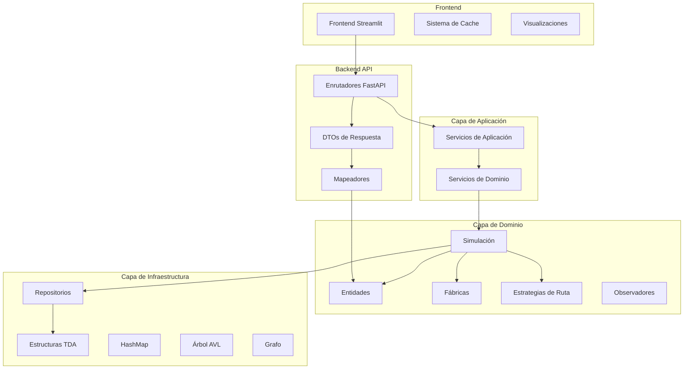
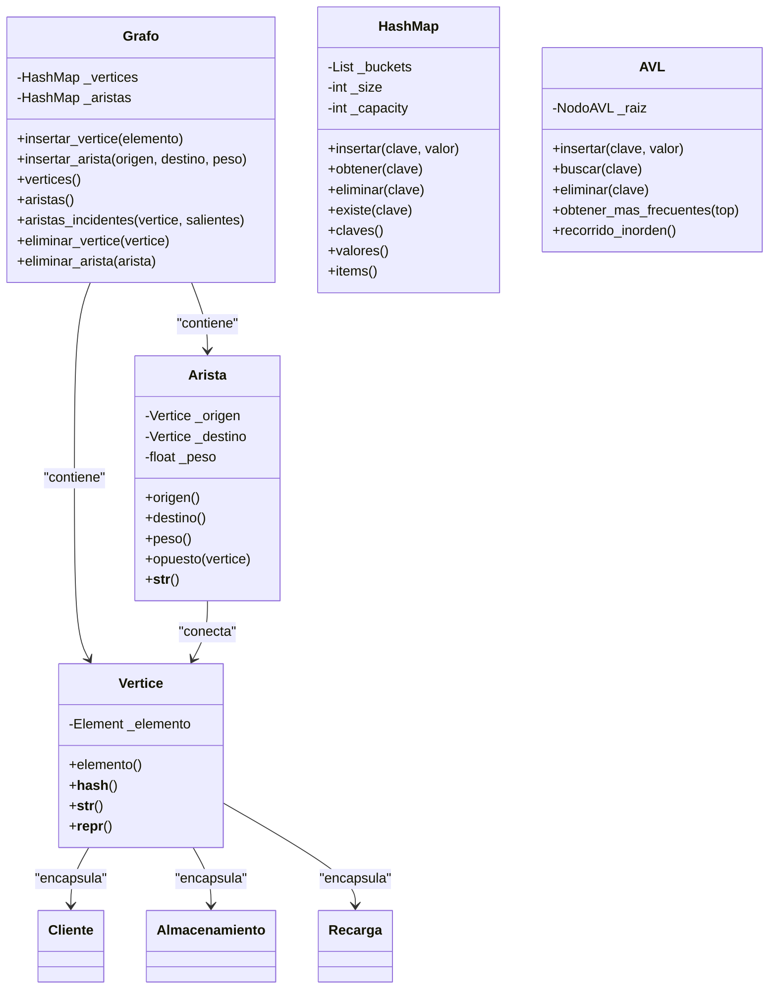
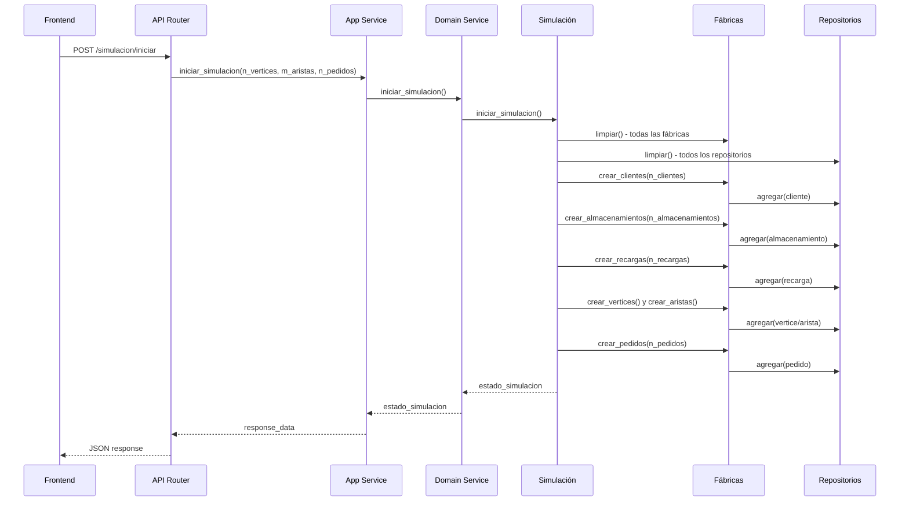
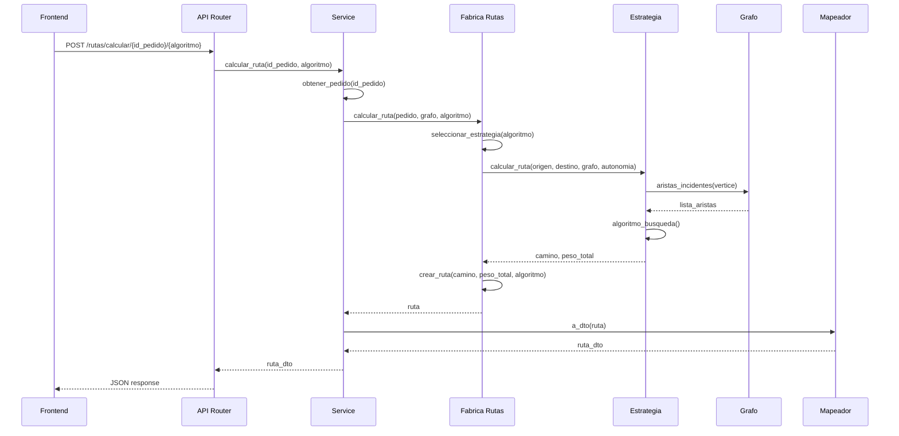
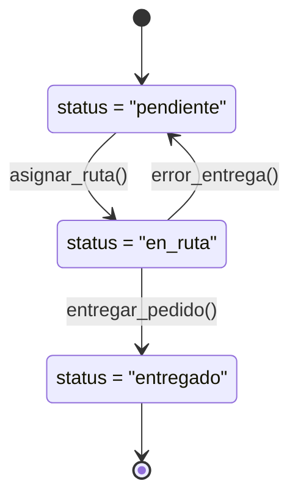
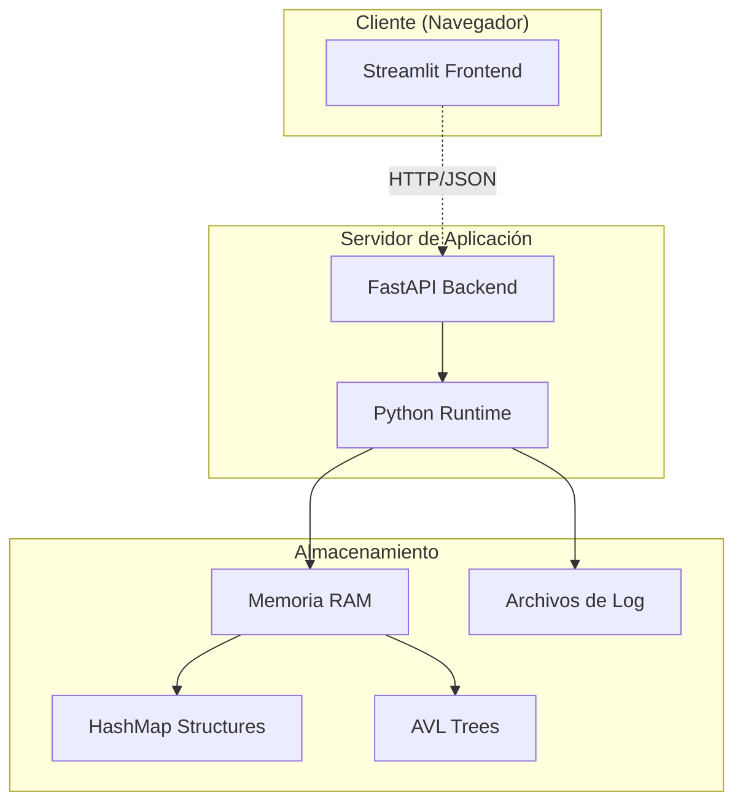
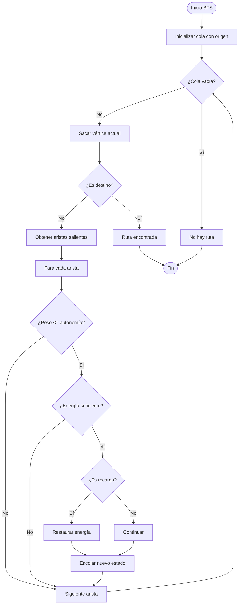
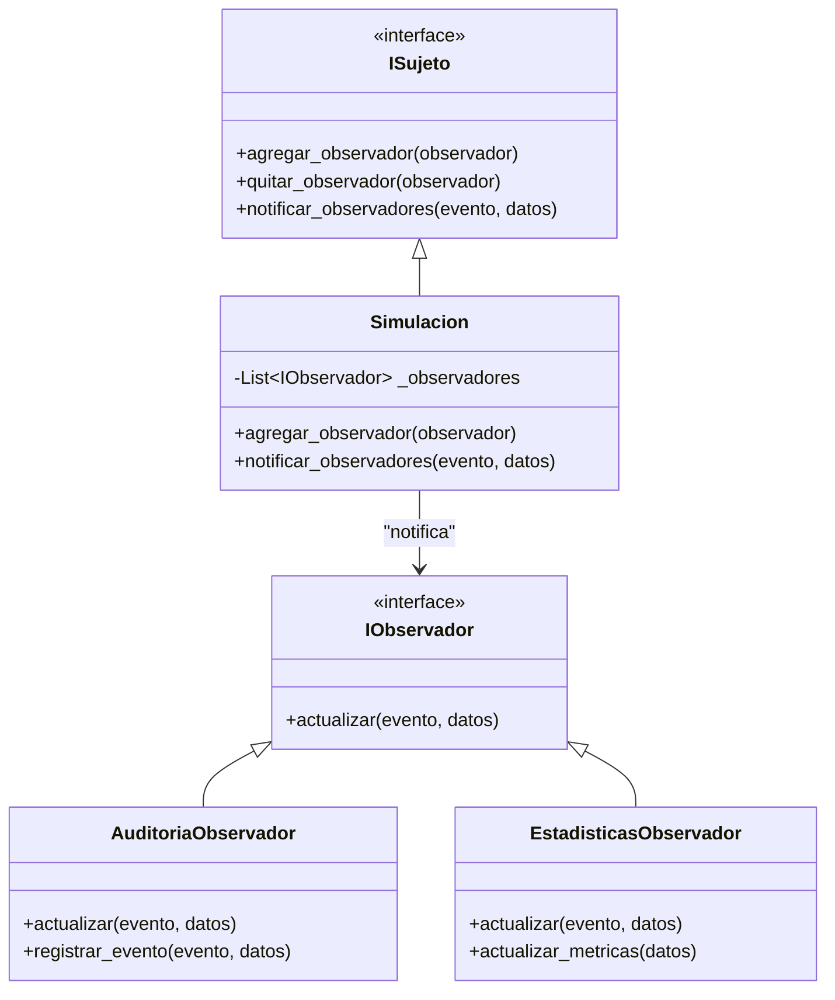

# Diagramas UML del Sistema de Simulación Logística

Este documento contiene todos los diagramas UML que describen la arquitectura y comportamiento del sistema de simulación logística de drones para Correos Chile.

## 1. Diagrama de Arquitectura General



## 2. Diagrama de Clases - Entidades de Dominio

```mermaid
classDiagram
    class Cliente {
        +int id_cliente
        +string nombre
        +string tipo_elemento = "cliente"
        -List~Pedido~ _pedidos
        +agregar_pedido(pedido)
        +eliminar_pedido(pedido)
        +obtener_pedidos()
        +total_pedidos()
        +limpiar_pedidos()
    }
    
    class Almacenamiento {
        +int id_almacenamiento
        +string nombre
        +string tipo_elemento = "almacenamiento"
        -List~Pedido~ _pedidos
        +agregar_pedido(pedido)
        +obtener_pedidos()
        +total_pedidos()
        +limpiar_pedidos()
    }
    
    class Recarga {
        +int id_recarga
        +string nombre
        +string tipo_elemento = "recarga"
        +__str__()
    }
    
    class Pedido {
        +int id_pedido
        +Vertice cliente_v
        +Vertice origen_v
        +Vertice destino_v
        +int prioridad
        +string status
        +Ruta ruta
        +datetime fecha_creacion
        +asignar_ruta(camino, peso_total)
        +actualizar_status(nuevo_status)
    }
    
    class Ruta {
        +Vertice origen
        +Vertice destino
        +List~Arista~ camino
        +float peso_total
        +string algoritmo
        +float tiempo_calculo
        +es_valida()
        +__str__()
    }
    
    Cliente ||--o{ Pedido : "tiene"
    Almacenamiento ||--o{ Pedido : "origina"
    Pedido ||--o| Ruta : "asignada"
```

## 3. Diagrama de Clases - TDA (Estructuras de Datos)



## 4. Diagrama de Secuencia - Inicialización de Simulación



## 5. Diagrama de Secuencia - Cálculo de Ruta



## 6. Diagrama de Estados - Pedido



## 7. Diagrama de Componentes - Estrategias de Ruta

```mermaid
graph TB
    subgraph "Estrategias de Ruta"
        IRuta[IRutaEstrategia]
        BFS[RutaEstrategiaBFS]
        DFS[RutaEstrategiaDFS]
        Dijkstra[RutaEstrategiaDijkstra]
        Floyd[RutaEstrategiaFloydWarshall]
        Topo[RutaEstrategiaTopological]
        Kruskal[RutaEstrategiaKruskal]
    end
    
    subgraph "Contexto"
        Fabrica[FabricaRutas]
        Sim[Simulación]
    end
    
    IRuta <|-- BFS
    IRuta <|-- DFS
    IRuta <|-- Dijkstra
    IRuta <|-- Floyd
    IRuta <|-- Topo
    IRuta <|-- Kruskal
    
    Fabrica --> IRuta : "usa"
    Sim --> Fabrica : "delega"
```

## 8. Diagrama de Despliegue



## 9. Diagrama de Flujo - Algoritmo BFS con Recarga



## 10. Diagrama de Observadores



## Convenciones de Diagramas

- **Líneas sólidas**: Relaciones fuertes/composición
- **Líneas punteadas**: Dependencias débiles/uso
- **Rombos sólidos**: Composición
- **Rombos vacíos**: Agregación
- **Triángulos**: Herencia/implementación

## Notas de Implementación

1. **Unicidad**: Todas las entidades se manejan mediante HashMap para garantizar O(1) y unicidad
2. **Estrategias**: Patrón Strategy para algoritmos de ruta intercambiables
3. **Observadores**: Patrón Observer para auditoría y eventos transversales
4. **TDA**: Estructuras de datos personalizadas optimizadas para el dominio
5. **Clean Architecture**: Separación clara entre capas con flujo de dependencias hacia el dominio
