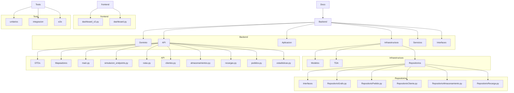

# Plan de Mejoras y Auditoría Integral para la Simulación de Drones – Correos Chile

Este documento unifica el plan de auditoría de instanciación única con el plan de mejora general del sistema, alineado con los requisitos de `Requisitos.md` y buenas prácticas SOLID.

## 1. Introducción

- Mantener la consistencia de instanciación y referencias únicas para Vértices, Aristas, Pedidos, Rutas y Grafo.
- Aplicar patrones de diseño (Singleton, Factory, Repository, Estrategia, Observer, Dependency Injection, Builder, Mapper).
- Refactorizar la arquitectura para escalabilidad, modularidad y facilidad de pruebas.
- Garantizar cumplimiento de estándares de código en español, snake_case y PascalCase.

## 2. Objetivos

1. Auditar e implementar instanciación única de objetos centrales.
2. Centralizar la creación y gestión de entidades en repositorios y fábricas.
3. Desacoplar algoritmos de ruta mediante Estrategia.
4. Introducir inyección de dependencias en servicios y bootstrap.
5. Separar mapeo dominio→DTO en mapeadores dedicados.
6. Publicar eventos relevantes (Observer) para UI y estadísticas en tiempo real.

## 3. Resumen de Auditoría (Plan existente)

### 3.1 TDA e Infraestructura
- Revisar y asegurar que `Modelo_Vertice.py`, `Modelo_Arista.py` y `TDA` (AVL, HashMap) gestionen correctamente `__hash__`, `__eq__` y no generen clones accidentalmente.
- Verificar que `Grafo` inserte y busque siempre las mismas instancias de vértices.

### 3.2 Objeto Grafo y Simulación
- Confirmar que `Simulacion` es Singleton y reinicializa grafo una sola vez.
- Auditar métodos `_generar_nodos`, `_generar_aristas` para evitar instanciaciones duplicadas.

### 3.3 Entidades del Dominio
- Validar la coherencia de `Cliente`, `Almacenamiento`, `Recarga`, `Pedido` y `Ruta`.
- Revisar la separación de responsabilidades: clientes gestionan solo sus pedidos; pedidos no crean clientes ni vértices.

### 3.4 Fábricas y Servicios
- Auditar `FabricaPedidos`: lista de errores, validaciones y logging.
- Verificar servicios de Dominio y Aplicación para inyección de instancias y evitar `new` dispersos.

### 3.5 API, DTOs y Frontend
- Revisar DTOs (`Dtos1`, `Dtos2`), extraer lógica de mapeo a mapeadores.
- Asegurar que el dashboard use datos consistentes y tablas de errores de fábrica.

## 4. Plan de Mejora Detallado

### 4.1 Infraestructura de Repositorios
#### 4.1.1 Crear estructura de carpetas y archivos
- [ ] `Infraestructura/Repositorios/` (directorio raíz)
- [ ] Archivos: `RepositorioGrafo.py`, `RepositorioPedido.py`, `RepositorioCliente.py`, `RepositorioAlmacenamiento.py`, `RepositorioRecarga.py`

**Código legacy a revisar/modificar/eliminar:**
- Uso directo de `TDA_Hash_map.HashMap` o `TDA_AVL.AVL` en `Simulacion_dominio.py`
- Manipulación de listas internas (`self.clientes`, `self.pedidos`, etc.) sin pasar por repositorios
- `hash_pedidos` en `Simulacion_dominio.py`

#### 4.1.2 Definir interfaces y contratos (IRepositorio*)
- [ ] `Infraestructura/Repositorios/Interfaces` (directorio raíz)
- [ ] `IRepositorioGrafo`: métodos CRUD para vértices y aristas
- [ ] `IRepositorioPedido`: métodos para creación, búsqueda, actualización y eliminación de pedidos
- [ ] `IRepositorioCliente`, `IRepositorioAlmacenamiento`, `IRepositorioRecarga` con operaciones específicas de dominio

**Código legacy a revisar/modificar/eliminar:**
- Acceso directo a estructuras internas en `Simulacion_dominio.py` y servicios

#### 4.1.3 Implementación de clases de repositorio
- [ ] `RepositorioGrafo`: delegar a TDA interno (HashMap y AVL)
- [ ] `RepositorioPedido`: usar `FabricaPedidos` y `TDA_HashMap` para almacenamiento en memoria
- [ ] `RepositorioCliente`, `RepositorioAlmacenamiento`, `RepositorioRecarga`: CRUD y validaciones de existencia

**Código legacy a revisar/modificar/eliminar:**
- Acceso directo a listas y TDAs en dominio y servicios

#### 4.1.4 Refactorización de TDA y Grafo
- [ ] Ajustar `Modelo_Grafo.py` para que reciba instancia de `RepositorioGrafo` en constructor
- [ ] Marcar `HashMap` y `AVL` como internos (no públicos) y accesibles solo vía repositorios

**Código legacy a revisar/modificar/eliminar:**
- Uso directo de `HashMap` y `AVL` fuera de repositorios

#### 4.1.5 Pruebas unitarias para repositorios
- [ ] Crear tests unitarios en `Tests/unitarios/` para cada repositorio: CRUD, condiciones de error y casos límite

---

### 4.2 Singletons Controlados
- [ ] Convertir `Simulacion` en Singleton puro:
  1. Constructor privado
  2. Método estático `instance()`
  3. Método `reiniciar()` para limpiar estado
  4. Tests de comportamiento singleton y reinicio
- [ ] Convertir `Grafo` en Singleton similar
- [ ] Actualizar bootstrap (`main.py` o `bootstrap.py`) para usar `instance()` en lugar de `new`

**Código legacy a revisar/modificar/eliminar:**
- Llamadas `new Grafo()` en el init de `Simulacion`
- Reinicializaciones directas en `reiniciar_instancia`
- Instanciaciones directas de `SimulacionDominioService()` y `Simulacion()` dentro de servicios

---

### 4.3 Patrón Estrategia para Algoritmos de Ruta
#### 4.3.1 Definir interfaz `IRutaEstrategia`
- [ ] Método `calcular(origen, destino, max_peso, forzar_recarga)`
#### 4.3.2 Implementaciones concretas
- [ ] `DijkstraEstrategia`
- [ ] `FloydWarshallEstrategia`
- [ ] `BFSEstrategia`
- [ ] La totalidad de las estrategias debe ser inyectada en `Simulacion` y endpoints API siguiendo el mismo patrón
- [ ] Tests comparativos de rutas entre estrategias
#### 4.3.3 Registro y fábrica de estrategias
- [ ] `RutaEstrategiaFabrica` que mapea claves a instancias de estrategia
- [ ] Configuración en `SimulacionConstructor` o bootstrap

**Código legacy a revisar/modificar/eliminar:**
- Código monolítico de `dijkstra_camino_minimo`, `bfs_camino`, `dfs_camino`, `topological_sort_camino` en `Simulacion_dominio.py`
- Validación de origen/destino y lógica de recorrido embebida

---

### 4.4 Extensión de Fábricas de Entidades
#### 4.4.1 Nuevas fábricas básicas
- [ ] `FabricaVertice`, `FabricaArista`, `FabricaCliente`, `FabricaAlmacenamiento`, `FabricaRecarga`
- [ ] Validaciones de datos y reglas de dominio centralizadas
#### 4.4.2 Integración con `FabricaPedidos`
- [ ] Ajustar `FabricaPedidos` para usar `FabricaCliente` y `FabricaAlmacenamiento`
- [ ] Manejo centralizado de errores y logging unificado
#### 4.4.3 Pruebas BDD para cada fábrica
- [ ] Escenarios de creación válida e inválida de cada entidad

**Código legacy a revisar/modificar/eliminar:**
- Validaciones duplicadas dentro de `Pedido.__init__` en `Dominio_Pedido.py`
- Creación directa de vértices y aristas en `Simulacion_dominio.py`

---

### 4.5 Inyección de Dependencias
- [ ] Crear módulo `bootstrap.py` o actualizar `main.py` para ensamblar dependencias
- [ ] Inyectar repositorios, fábricas y logger en:
  - `SimulacionDominioService`
  - `SimulacionAplicacionService`
- [ ] Añadir tipos de constructor y validaciones de DI
- [ ] Tests que usan mocks para simular repositorios y fábricas

**Código legacy a revisar/modificar/eliminar:**
- Instanciaciones directas de servicios y dependencias en servicios y dominio

---

### 4.6 Mapeadores de Dominio a DTO
- [ ] Directorio `API/Mapeadores/`
- [ ] Clases estáticas: `PedidoMapper`, `RutaMapper`, `ClienteMapper`, `AlmacenamientoMapper`, `RecargaMapper`
- [ ] Mover lógica de conversión de `Dtos1`/`Dtos2` a mapeadores de forma modular
- [ ] Tests de mapeo bidireccional dominio↔DTO

**Código legacy a revisar/modificar/eliminar:**
- Funciones utilitarias `pedido_a_dto`, `ruta_a_dto`, etc. en `Dtos1.py`

---

### 4.7 Patrón Observer
#### 4.7.1 Definición de eventos
- [ ] Clases de evento: `PedidoCreado`, `RutaCalculada`, `PedidoEntregado`, `EstadisticaActualizada`
#### 4.7.2 Implementación de `Observer`
- [ ] Suscripción: método `subscribirse(tipo_evento, manejador)`
- [ ] Publicación: método `publicar(instancia_evento)`
- [ ] Integrar suscriptores en UI y módulo de estadísticas
- [ ] Tests de flujo de eventos

**Código legacy a revisar/modificar/eliminar:**
- Callbacks ad-hoc o prints dispersos en `Pedido`, `Simulacion`, `Servicios_Simulacion`

---

### 4.8 Builder y Factory Method
- [ ] `SimulacionConstructor` con métodos encadenados para:
  - Seleccionar repositorios y fábricas
  - Asignar estrategia de rutas
  - Configurar parámetros de grafo y pedidos iniciales
- [ ] Método `build()` para devolver instancia configurada de `Simulacion`
- [ ] Ejemplos de uso en tests y bootstrap

**Código legacy a revisar/modificar/eliminar:**
- Argumentos primitivos pasados a `Simulacion.new` e `init` directamente

---

### 4.9 Refactorización de UI y Tests
- [ ] Actualizar `frontend/dashboard_v2.py` para usar repositorios y Observer
- [ ] Mostrar tabla de errores de fábrica en interfaz
- [ ] Ajustar endpoints API para usar mapeadores y DI
- [ ] Ejecutar y adaptar suites de tests unitarios, integración y E2E para nueva arquitectura

**Código legacy a revisar/modificar/eliminar:**
- Cachés redundantes que repiten el mismo `@st.cache_data` en dashboard
- Acceso directo a datos sin pasar por servicios/mapeadores
- Tests en `Tests/` (unitarios, integración y e2e) que validan instanciación única, CRUD de repositorios, mapeos, estrategias y Observer

---

## 5. Arquitectura y Estructura de Archivos (Mermaid)

---

Con este plan fusionado de auditoría y mejoras, se asegura una arquitectura robusta, escalable y alineada con los requisitos de `Requisitos.md` y mejores prácticas de diseño. Siempre ten en cuenta que la implementación debe seguir los principios SOLID y mantener una alta cohesión y bajo acoplamiento entre componentes inyectando dependencias adecuadamente en todo el sistema.
