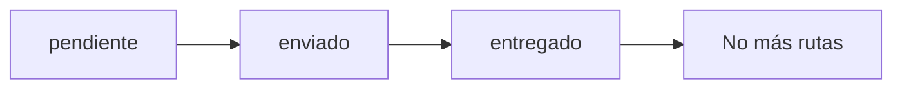

# 📚 Documentación Swagger - API Simulación Logística de Drones

## 🚀 Inicio Rápido

### Ejecutar la API con Swagger
```bash
python run_api_swagger.py
```

### Acceder a la Documentación
- **Swagger UI Interactive**: http://localhost:8000/docs
- **ReDoc Documentation**: http://localhost:8000/redoc
- **OpenAPI JSON Schema**: http://localhost:8000/openapi.json

## 📋 Endpoints Principales

### 🎯 Simulación
- `POST /simulacion/iniciar` - Crear nueva simulación
- `GET /simulacion/info` - Estado actual de la simulación
- `GET /simulacion/snapshot` - Datos completos del sistema

### 🛣️ Rutas
- `POST /rutas/calcular/{id_pedido}/{algoritmo}` - Calcular ruta individual
- `POST /rutas/calcular/{id_pedido}/todos` - Calcular con todos los algoritmos
- `POST /rutas/entregar/{id_pedido}` - Marcar pedido como entregado
- `GET /rutas/por_pedido/{id_pedido}` - Rutas de un pedido específico

### 📦 Pedidos
- `GET /pedidos/` - Listar todos los pedidos
- `PATCH /pedidos/{id}/estado` - Actualizar estado de pedido
- `GET /pedidos/{id}` - Obtener pedido específico

### 📊 Estadísticas
- `GET /estadisticas/` - Métricas generales del sistema
- `GET /estadisticas/rutas_frecuentes` - Rutas más utilizadas
- `GET /estadisticas/vertices_visitados` - Vértices más transitados

### 🏢 Entidades
- `GET /vertices/` - Todos los vértices de la red
- `GET /aristas/` - Todas las conexiones
- `GET /clientes/` - Vértices tipo cliente
- `GET /almacenamientos/` - Centros de distribución
- `GET /recargas/` - Estaciones de carga

## 🔧 Algoritmos Disponibles

| Algoritmo | Descripción | Complejidad | Uso Recomendado |
|-----------|-------------|-------------|-----------------|
| `bfs` | Búsqueda en Amplitud | O(V + E) | Caminos con pocos saltos |
| `dfs` | Búsqueda en Profundidad | O(V + E) | Exploración exhaustiva |
| `dijkstra` | Camino más corto ponderado | O((V + E) log V) | Rutas óptimas por costo |
| `floydwarshall` | Todos los caminos más cortos | O(V³) | Análisis global |
| `topologicalsort` | Ordenamiento topológico | O(V + E) | Grafos dirigidos acíclicos |

## 📝 Estados de Pedidos



- **pendiente**: Recién creado, esperando ruta
- **enviado**: Ruta asignada, drone en camino  
- **entregado**: Completado (bloquea nuevas rutas)

## 🔄 Flujo Típico de Uso

1. **Inicializar simulación**
   ```http
   POST /simulacion/iniciar
   {
     "n_vertices": 15,
     "m_aristas": 20,
     "n_pedidos": 10
   }
   ```

2. **Explorar la red generada**
   ```http
   GET /vertices/
   GET /aristas/
   GET /pedidos/
   ```

3. **Calcular rutas para pedidos**
   ```http
   POST /rutas/calcular/1/dijkstra
   POST /rutas/calcular/2/bfs
   ```

4. **Marcar entregas completadas**
   ```http
   POST /rutas/entregar/1
   PATCH /pedidos/1/estado
   Body: "entregado"
   ```

5. **Analizar estadísticas**
   ```http
   GET /estadisticas/
   GET /estadisticas/rutas_frecuentes
   ```

## 🎨 Características del Frontend

### Pestañas Disponibles
1. **Ejecutar Simulación** - Configurar e iniciar simulaciones
2. **Explorar Red** - Visualizar grafo y calcular rutas
3. **Clientes y Pedidos** - Gestionar pedidos y marcar entregas
4. **Análisis de Rutas** - Estadísticas y árbol AVL
5. **Estadísticas** - Métricas generales del sistema

### Funcionalidades Especiales
- ✅ Marcar pedidos como completados desde la interfaz
- 📊 Visualización de grafos con NetworkX y Matplotlib
- 🔄 Actualización en tiempo real de datos
- 📈 Gráficos estadísticos interactivos
- 🗺️ Representación visual de rutas calculadas

## 🧪 Pruebas en Swagger UI

### Ejemplo 1: Simulación Básica
```json
POST /simulacion/iniciar
{
  "n_vertices": 15,
  "m_aristas": 20,
  "n_pedidos": 10
}
```

### Ejemplo 2: Calcular Ruta Óptima
```json
POST /rutas/calcular/1/dijkstra
```

### Ejemplo 3: Marcar Entrega
```json
POST /rutas/entregar/1
```

### Ejemplo 4: Actualizar Estado
```json
PATCH /pedidos/1/estado
Body: "entregado"
```

## 🔧 Configuración y Troubleshooting

### Verificar Estado de la API
- `GET /` - Información básica
- `GET /health` - Estado de salud del sistema
- `GET /algoritmos` - Lista de algoritmos disponibles

### Logs y Debug
- Los logs se muestran en la consola donde se ejecuta `run_api_swagger.py`
- Nivel de log configurable en el script
- Endpoints de debug con sufijo `/hashmap` para inspección interna

### CORS
La API tiene CORS habilitado para desarrollo local, permitiendo requests desde cualquier origen.

## 📱 Integración con Frontend

El frontend Streamlit consume esta API a través del módulo `frontendv2/servicios/api.py`.

### URLs del Frontend
- **Streamlit App**: http://localhost:8501 (ejecutar con `streamlit run frontendv2/main.py`)
- **API Backend**: http://localhost:8000

## 🏗️ Arquitectura

```
Frontend (Streamlit) <--> API (FastAPI) <--> Dominio <--> Repositorios <--> TDA
```

- **API**: Endpoints RESTful con validación y documentación
- **Dominio**: Lógica de negocio (Pedidos, Rutas, Simulación)
- **Repositorios**: Acceso a datos con HashMap/AVL
- **TDA**: Estructuras de datos personalizadas

---

**¡Explora la documentación interactiva en http://localhost:8000/docs!** 🎉
